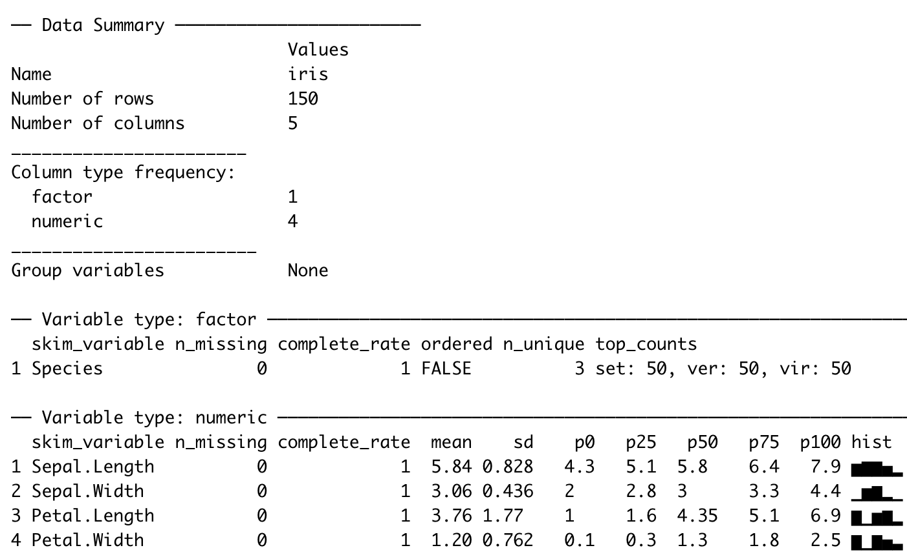
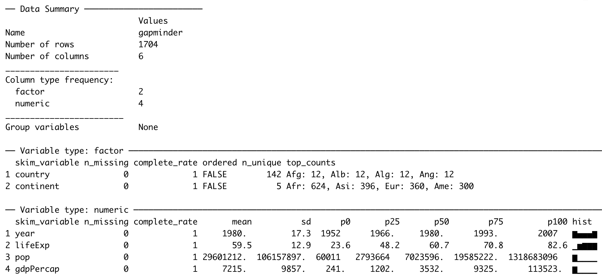

# Explorativ dataanalys {#eda}

## Vad är Explorativ Dataanalys?


- En kreativ iterativ process där man ställer frågor/gör hypoteser om sin data och sedan utforskar dem
  


- Mera konkret kan det beskrivas som
 1. Formulera en hypotes
 2. Transformera din data - om nödvändigt
 3. Visualisera din data (vårt fokus idag)
 4. Modellera - om nödvändigt
 5. Formulera nya hypoteser


- Mindset inte formel!

-

### Exempel på basala frågor/hypoteser

Frågeställningar kan vara vaga!


  - Vad för data innehåller de olika kolonnerna?
  

  
  - Hur ser Datans kvalitét ut? e.g missing values, felaktiga tabellvärden, duplicerade värden
  


  - Finns det outliers?
  


  - Medelvärde, spridning
  
-

### Hur gör man i R?

R har basfunktionalitet som kan användas för att snabbt få en numerisk överblick datan t.ex
`summary()` och `head()`

```{r iris_sum}
summary(iris)
```


```{r iris_head}
head(iris)
```

### Hur gör man i R?

R har även mer avancerade verktyg:
- `dlookr`, ta fram rapport för datakvalitét

- `skimr`, snabb explorativ analys (som vi kommer använda idag)


```{r eval = F}
skim(iris)
```



## Datavisualisering

- Grunden i explorativ dataanalys 


- Visualisering är grundläggande för att människor ska kunna få en överblick av data


### Varför visualisera?

Anscombe quartet - Dataset skapat av Francis Anscombe 1973

```{r anscombe, echo=FALSE, message=FALSE, warning=FALSE}
library(tidyverse)
library(broom)
anscombe_tidy <- anscombe %>%
    mutate(observation = seq_len(n())) %>%
    gather(key, value, -observation) %>%
    separate(key, c("variable", "set"), 1, convert = TRUE) %>%
    mutate(set = c("I", "II", "III", "IV")[set]) %>%
    spread(variable, value)

head(anscombe_tidy, 10)
```


### Vad är det första vi gör?

```{r anscombe_summary, echo=FALSE, message=FALSE, warning=FALSE}
anscombe_tidy %>%
  group_by(set) %>%
  summarise_at(vars(x, y), lst(mean, sd))
```

Ser bra ut!

### Steg 2: anpassar en linjär modell
```{r ancombe_lm}
anscombe_tidy %>% 
  nest(observation, x, y) %>% 
  mutate(model = map(data, ~lm(y ~ x, data = .x)),
         tidy = map(model, broom::tidy)) %>% 
  unnest(tidy) %>% 
  filter(term == "x") %>% 
  select(set, estimate, std.error, statistic)
```

Ser inte ut som att det är någon skillnad mellan grupperna

Men...

```{r anscombe_final, echo=FALSE}
library(ggplot2)
ggplot(anscombe_tidy, aes(x, y)) +
  geom_point() +
  facet_wrap(~set) +
  geom_smooth(method = "lm", se = FALSE) +
  theme_light() +
  labs(
       caption = "Source: Anscombe, F. J. (1973). Graphs in Statistical Analysis")
```

Statistiska mått kan gömma mycket av sanningen!

## Datasaurus Dozen

Modern variant av Anscombe - skapat av Alberto Cairo
```{r datasauRus}
library(datasauRus)
datasaurus_dozen %>% 
  group_by(dataset) %>%
  summarise(x_mean = mean(x), y_mean = mean(y), 
            x_sd = sd(x), y_sd = sd(y),
            corr = cor(x,y)) 
```

Datasaurus Dozen

```{r}
ggplot(datasaurus_dozen, aes(x=x, y=y))+
  geom_point()+
  theme_minimal() +
  facet_wrap(~dataset)
```

Eller som animering:

```{r}
library(datasauRus)
library(ggplot2)
library(gganimate)

ggplot(datasaurus_dozen, aes(x=x, y=y))+
  geom_point()+
  theme_minimal() +
  transition_states(dataset, 3, 1) + 
  ease_aes('cubic-in-out')
```


## Workflow för nytt dataset

- Börja *alltid* med visualisering, särskilt om du ska göra modellering

- explorativ visualisering är en iterativ process

- Börjar övergripande sedan mera specialiserade beroende på hur dina hypoteser/frågor utvecklas

Gör *alltid* explorativ analys med ett programmeringsspråk

- Det gör att din analys finns dokumenterad

- Du kan dela med den till andra

- Den är reproducerbar och kan granskas 

Saker du bör undvika: BI-verktyg för explorativ analys och Excel.


## Gapminder

- Vi har fått ett dataset `gapminder` och egentligen inga andra uppgifter och vi vill förstå det


- Vi börjar med att snabbt kolla på datan med `head()`


```{r gapminder_head}
library(gapminder)
head(gapminder)
```

- Undersöker med hjälp av `summary()`/`skim()`


```{r gapminder_sum}
summary(gapminder)
```


```{r gapminder_skim, eval=F}
library(skimr)
skim(gapminder)
```


### Datapunkter per land?
```{r}
gapminder %>% filter(country == "Sweden") %>% arrange(year)
```


#### Naturlig fråga: Hur påverkar ekonomisk utveckling den förväntande livslängden i ett land?


För att undersöka den här frågan så vill vi göra en visualisering med hjälp av `ggplot2`

Då behöver vi först 

## Grammar of grahics

### 1. Data

För att minska mängden data kollar vi bara på ett år
```{r gapminder_data}
data <- gapminder %>%
  filter(year == 1972)

ggplot(data)
```


### 2. Aesthetics

- Vi behöver `mappa` data till visualiseringen. Vi mappar data till `aestethics` i visualiseringen. En `aesthetic` kan vara exempelvis `x`-axeln eller `y`-axeln.

- För att svara på vår fråga kan vi exempelvis mappa `gdpPercap` till `x`-axeln och `lifeExp` till `y`-axeln

```{r gapminder_aes}
ggplot(data = data, aes(x = gdpPercap, y = lifeExp))
```

### 3. Geometriska objekt

Vi behöver geometriska objekt som representerar data, exempelvis punkter, linjer eller staplar.

I ggplot2 kallas dessa för `geoms`, exempelvis:

`geom_point()`: punkter,

`geom_line()`: linjer,

`geom_bar()`: staplar

```{r gapminder_geoms}
ggplot(data = data, aes(x = gdpPercap, y = lifeExp)) +
  geom_point()
```

Det verkar finnas ett samband, kan vi förstå mera?

Mer `aesthetics`

```{r gapminder_aes_color}
p <- ggplot(data = data,
            aes(x = gdpPercap,
                y = lifeExp,
                color = continent)) +
  geom_point()
```

```{r echo = F}
p
```

#### Storlek ~ invånare

ännu mer `aesthetics`

```{r gapminder_aes_size}
ggplot(data = data,
       aes(x = gdpPercap,
                     y = lifeExp,
                     color = continent,
                     size = pop)) + 
  geom_point()
```

### 4. Skala

Vilken skala ska axlarna i grafen ha?

```{r gapminder_scale1}
ggplot(data = data, aes(x = gdpPercap, y = lifeExp,
                                  size = pop, color = continent)) +
  geom_point() +
  scale_y_continuous() + ## Default value
  scale_x_continuous() 
```

### GDP per capita är skevt fördelad

Vanligt i variabler som motsvarar pengar

```{r gapminder_gdp}
ggplot(data, aes(x = gdpPercap)) +
  geom_density()

```


#### Logaritmisk skala 

Genom att ta logaritmen kan vi justera för den skeva fördelningen

```{r gapminder_gdplog}
ggplot(data, aes(x = gdpPercap)) +
  geom_density() +
  scale_x_log10() ##
```


```{r gapminder_log}
ggplot(data = data, aes(x = gdpPercap,
                                  y = lifeExp,
                                  size = pop,
                                  color = continent)) +
  geom_point() +
  scale_x_log10() 

```


##<4 Hans Roslings berömda visualisering

```{r hans_rosling}
library(gganimate)
library(gapminder)

ggplot(gapminder, aes(gdpPercap, lifeExp, size = pop, colour = continent)) +
  geom_point(alpha = 0.7) +
  #scale_colour_manual(values = country_colors) +
  scale_size(range = c(2, 12)) +
  scale_x_log10() +
  guides(color= guide_legend(), size=FALSE) +
  theme_light() +
  labs(title = 'Year: {frame_time}', 
       x = 'GDP per capita',
       y = 'life expectancy') +
  transition_time(year) +
  ease_aes('linear')
```

### 5. Statistiska beräkningar

För att kvantifiera sammanbandet mera kan vi också lägga till statistiska beräkningar till grafen

```{r gapminder_lm}
ggplot(data = data, aes(x = gdpPercap,
                                  y = lifeExp,
                                  size = pop,
                                  color = continent)) +
  geom_point() +
  scale_x_log10() +
  stat_smooth(method = "lm")
```

- Nu beräknas statistik per grupp. Det är eftersom att vi specificerat i vår `aes()` i `ggplot()`. 

- Vi kan flytta `aes()` till våra geometriska objekt om vi vill beräkna statistik för hela gruppen.

```{r gapminder_lm_all}
ggplot(data = data, aes(x = gdpPercap, y = lifeExp)) +
  geom_point(aes(size = pop, color = continent)) +
  scale_x_log10() +
  stat_smooth(method = "lm")
```

### 6. Facets

Vi kan också dela upp grafen i flera visualiseringar

```{r gapminder_facets}
ggplot(data = data, aes(x = gdpPercap,
                                  y = lifeExp,
                                  size = pop,
                                  color = continent)) +
  geom_point() +
  scale_x_log10() +
  stat_smooth(method = "lm") +
  facet_wrap(~continent)
```

Vi kan också specificera skalorna för varje subplot

```{r gapminder_facet_scale}
ggplot(data = data, aes(x = gdpPercap,
                                  y = lifeExp,
                                  size = pop,
                                  color = continent)) +
  geom_point() +
  scale_x_log10() +
  stat_smooth(method = "lm") +
  facet_wrap(~continent, scales = "free")
```

### 7. Koordinatsystem

- Ett sista lager vi skulle kunna använda för att ändra vår graf
- Exempelvis Kartesiskt eller Polärt
- Polärt för exempelvis cirkeldiagram


### Grammar of graphics

R Paketet som har använts heter `ggplot2` och det bygger på en variant av *The Grammar of Graphics* och består av de 7 beståndsdelar vi precis gått igenom

.footnote[
Wickham, H (2010), _"A layered Grammar of Graphics"_, Journal of Computational and Graphical Statistics, vol. 19, no. 1, pp. 3–28,
]


1. Data


2. Aesthetics


3. Geometric Objects


4. Scale


5. Statistics


6. Facets


7. Coordinate systems

(8.) Labels, titlar, legends


Som kan manipuleras för att skapa de visualiseringar vi vill ha

## Gapminder - fortsättning

Vi såg att det fanns en outlier i `gdpPercap` per `lifeExp`

```{r echo = F}
data %>% 
  mutate(Color = ifelse(country == "Kuwait", 'red', 'gray')) %>%
  ggplot(aes(x = gdpPercap, y = lifeExp, color = Color)) +
  geom_point() + scale_color_identity()
```

Vilket land är det?

```{r}
data %>% arrange(desc(gdpPercap))
```

Är det en utveckling som håller i sig?

```{r}
kuwait_data <- gapminder %>% 
  filter(country == "Kuwait")

kuwait_data %>%
  ggplot(aes(x=year, y=gdpPercap)) +
  geom_line(color='red') + scale_color_identity()
```


I jämförelse med utveckingen i resten av toppländerna 1972?

```{r}
top_countries <- data %>%  top_n(11, gdpPercap) %>% 
  filter( country!= 'Kuwait') %>% 
  pull(country)
top_countries

top_mean <- gapminder %>% 
  filter(country %in% top_countries) %>% 
  group_by(year) %>%  
  summarise(gdp_mean = mean(gdpPercap))
top_mean

data_added_mean <- kuwait_data %>% add_column(
  "mean" = top_mean$gdp_mean)

data_added_mean %>% 
  ggplot(aes(x = year)) + 
  geom_line(aes(y = gdpPercap), color = 'red') +
  geom_line(aes(y = mean), color = 'gray') + 
  scale_color_identity()
```

## EDA är en nyfiken process utan slut!

Det finns i princip alltid mera saker man skulle kunna undersöka som:


* Hur ser utvecklingen ut om vi istället för att undersöka BNP per kapita, undersöker totala BNP per land? 


* Om vi utesluter Kuwait som en outlier 1972? 


* Om vi inför en annan gruppering?


* etc..

### Det ni ska ta med er idag är inte de specifika sakerna vi har undersökt, utan ett mindset!

## Länkar till resurser

- [R for Data Science](https://r4ds.had.co.nz/) - fantastisk bok som har bra material om alling Data Science

- [Visual Vocabulary](https://ft-interactive.github.io/visual-vocabulary/) - Financial Times referensmaterial för visualiseringar

- [ggplot2](https://ggplot2.tidyverse.org/) - dokumentation för ggplot2

- [kaggle](https://www.kaggle.com/) - Hemsida med AI/ML tävlingar och källa till gratis dataset

- [stack overflow](https://www.stackoverflow.com) - Forum för programmeringsfrågor, där svar på nästan alla problem man stöter på finns


## Övningar Explorativ dataanalys

Datan vi använder idag kommer från Hemnet!

```{r prepare-hem, message=FALSE, warning=FALSE}
library(tidyverse)      # Innehåller många mindre paket bl.a ggplot2
library(scales)         # Färghanteringspaket
library(gapminder)      # Datasetet gapminder
library(hrbrthemes)     # Teman till ggplot2

hem <- read_csv("https://raw.githubusercontent.com/Ferrologic/ds-program-block2/master/data/hemnet_data.csv")

hem
```

Vi kan börja med att använda `skim()` från `skimr` på vårt dataset.

```{r load_skim, error=TRUE}
library(___)

skim(___)
```


Det var mycket information. Men vi kan försöka plocka ut några delar. 

Hur många rader och kolumner har datasetet?

Vad för typ av data är kolumnen `area`?

I vilken kolumn saknas det flest värden?

Men vad innehåller egentligen kolumnerna `area`, `type`? För att svara på det så kan vi titta på några rader av dataset med R:s inbyggda funktion `head()`

```{r load_head, error=TRUE}
head(___)
```

Säg att det företag du jobbar på endast är intresserad av Stockholm, Malmö och Göteborg då börjar vi med att endast titta på de försäljningar som gjorts där:

Om du känner att du hellre vill undersöka några andra städer så är det bara att skriva in dem istället, men försäkra dig om att städerna finns med genom att exempelvis använda `hem %>% filter(city == 'din stad')` eller `hem[hem$city == 'din stad',]`.

```{r hem_stader, error=TRUE}
hem_storstad <- hem %>% filter(city %in% c('stockholm', 'malmö', ___))
```

Hur har de slutgiltiga priserna i storstäderna sett ut? 


```{r stader_density, error=TRUE}
ggplot(___, 
          aes(x = ___)) +
  geom_density()
```

Är det nån skillnad mellan städerna? Det kan vi undersöka med hjälp av färg och en ridgeplot:


```{r stader_density2, error=TRUE}
library(ggridges)
ggplot(___, 
          aes(x = ___, 
              y = city,
              color = ___,
              fill = city)) + geom_density_ridges()
```


Vill vi göra en lättare jämförelse mellan städerna kan vi använda `geom_density()` istället och färg. Notera användandet av `alpha` och jämför med det tidigare kommandot. Det är också värt att notera användandet av parametern `alpha`, som styr hur genomskinliga de olika densiteterna är.

```{r, error=TRUE}
___ %>% ggplot(aes(x = ___,
                            color = city, 
                            fill = city)) +
  geom_density(alpha=0.5)
```

Som i `gapminder`-exemplet från presentationen så är fördelningen för final price skev. 
Igen så kan vi använda en logaritmisk skala på x axeln `scale_x_log10()` för att motverka detta.

```{r}
hem_storstad <- hem %>% filter(city %in% c('stockholm', 'malmö', "göteborg"))

hem_storstad %>% ggplot(aes(x = final_price, 
                            color = city, fill = city)) +
  geom_density(alpha = 0.5) +
  scale_x_log10()
```

Vad kan vi se för skillnader mellan fördelingen av slutpriser mellan de städerna?
Vilken stad är dyrast?
Vad är det vanligaste priset ungefär?
Är det någon stad som är mer olik de andra?

Det går självklart att fortsätta att ställa mera frågor och undersöka dem, men nu kommer resten av övningarna att fokusera på att introducera flera sorters visualiseringar!

## Fördelningar 

I de flesta fall är vi intresserade av fördelningar. De vanligaste typerna av visualiserings för fördelingar är dessa:

Densitetsdiagram:

```{r p_den}
library(gapminder)
ggplot(gapminder, aes(x = gdpPercap)) +
  geom_density()
```

Histogram:

```{r p_hist}
ggplot(gapminder, aes(x = gdpPercap)) +
  geom_histogram()
```

Boxplots:

```{r p_box}
ggplot(gapminder, aes(x = continent, y = gdpPercap)) +
  geom_boxplot()
```

Fioldiagram:

```{r p_fiol}
ggplot(gapminder, aes(x = continent, y = gdpPercap)) +
  geom_violin()
```

Ridgediagram:

```{r p_ridges}
library(ggridges)
ggplot(gapminder, aes(x = gdpPercap, y = continent, fill = continent)) +
  geom_density_ridges() +
  theme_ridges() + 
  theme(legend.position = "none")
```

För att direkt jämföra grupperna går även ett densitetsdiagram med färg att använda

```{r}
ggplot(gapminder, aes(x = gdpPercap, color = continent)) +
  geom_density(aes(fill = continent, alpha = 0.7))

```

### Skalor och fördelningar 

I verkligheten är data sällan normalt fördelad. Med den underliggande statistiska processen kan ofta vara det. Därför kan det vara klokt, om data är skevt fördelat, att testa att använda en annan skala på data. Det finns flera olika sätt att transformera data till en annan skala men ett av de vanligaste är att ta logaritmen.

Nedan skalar vi x-axeln med `log10()`, som är den logaritm vi oftast använder i "verkligheten". 

```{r p_log}
ggplot(gapminder, aes(x = gdpPercap)) +
  geom_histogram() +
  scale_x_log10()
```

### Övningar - Fördelning

Nu är det din tur att prova på de här graferna på hemnetdatan `hem`.
Hur ser fördelningen ut för `final_price`?

```{r plot_fp, error=TRUE}
ggplot(aes(_)) +
  geom_
```


Hur ser fördelningen ut för respektive `type`? Nedan använder du dig av en ridge-plot.

```{r ex_ridge, error=TRUE}
library(ggridges)
ggplot(hem, aes(x = final_price, y = _, fill = type)) +
  geom_density_ridges() +
  theme_ridges() + 
  theme(legend.position = _) +
  scale_x_continuous(labels = scales::number)
```


Boxplot är en annan värdefull visualiseringstyp. Den kalkylerar även outliers, som är de svarta prickarna. Outliers är här definierade som Q3 + 1.5*IQR, d.v.s. den tredje kvartilen + 1.5 gånger avståndet mellan kvartil 1 och kvartil 3.

- Visualisera slutpris per bostadstyp 
- Notera att vi använder `scales` i `scale_x_continuous()` för att få snyggare formatering på x-axlen. `scales` har också formateringsalternativ för procent, kr/$/€ med mera.

```{r p_flip, error=TRUE}
ggplot(hem, aes(x = final_price, y = _, fill = _)) +
  geom_boxplot() + 
  theme(legend.position = "none") +
  scale_x_continuous(labels = scales::number_format(suffix = "kr"))
```

## Korrelation

Visualisera relationen mellan `list_price` och `final_price`.

- Vad är dina `aesthetics`?
- Vilken `geom_` använder du?
- Passar skalan?
- Finns det någon passande statistic för att visuellt beskriva relationen?

```{r p_rel, error=TRUE}
ggplot(_, aes(x = _, y = _)) +
  geom_ +
  stat_
```

## Pimp my plot!

Vi kan addera titlar och data-etiketter med `labs()`. 

```{r p_labs}
p <- ggplot(mtcars, aes(mpg, hp, color = am)) +
  geom_point() +
  labs(title = "Min titel",
       x = "Min x-axel",
       y = "Min y-axel", 
       subtitle = "Min subtitle",
       caption = "Källa: Min caption",
       color = "Legend-titel")

p
```

## Vi kan ändra tema med `theme_...`

```{r p_theme}
p + theme_minimal()
```

Utgå från relationen mellan slutpris och listpris. Ändra labs och lägg till ett tema.

*OBS* Det finns en uppsjö av olika teman. Exempelvis i paketen `hrbrthemes`, `ggthemes`, `ggthemr` m.m. Du kan också skapa dina egna teman exempelvis med företagsfont och färger. Testa gärna exempelvis theme_economist() och theme_solarized_2()

```{r p_labs_ex, error=TRUE}
library(ggthemes)
ggplot(hem, aes(x = list_price, y = final_price)) +
  geom_point() +
  stat_smooth() +
  labs(title = "",
       x = "",
       y = "", 
       subtitle = "",
       caption = "") +
  theme_
```

## Andra aesthetics 

- Utgå från din visualisering av relationen mellan utropspris och slutpris
- Mappa vår aesthetic `color` till en numerisk variabel, exempelvis `fee`. 
- Vad händer om vår data har stora outliers? (testa att mappa `color` till sq_m)

```{r p_color, error=TRUE}
ggplot(hem, aes(x = list_price, 
                y = final_price,
                color = ___)) +
  geom_point() +
  stat_smooth()
```

## Diskreta variabler

- Utgå från din visualisering av relationen mellan utropspris och slutpris
- Mappa vår aesthetic `color` till en kategorisk variabel, notera att kategoriska variabler med fler än 30 kategorier kommer att bli svåra att visualisera. Se exempelvis city och area, som du därmed bör undvika.
- Om det är en kategorisk variabel som är numerisk behöver du ändra den med `as.factor()`

```{r p_color_fct, error=TRUE}
ggplot(hem, aes(x = list_price, 
                y = final_price,
                color = ...)) +
  geom_point() +
  stat_smooth()
```


## Facets 

- Visualisera fördelningen per bostadstyp med sub-plots istället
- Hur hanterar du x-axeln? Finns det något sätt att göra den snyggare?
- För att hantera långa labels i `facet_wrap()` kan du använda funktionen `labeller` och `label_wrap_gen(10)`.

```{r p_facet, error=TRUE}
ggplot(hem, aes(final_price)) +
  geom_histogram() +
  scale_x_log10() +
  facet_wrap(~___, labeller = labeller(type = label_wrap_gen(10)), scales = "free")
```


## Barcharts på aggregerade tabeller

Inte sällan har vi aggregerade tabeller som vi vill visualisera.

```{r prepare-gap}
gap_continent <- gapminder %>% 
  group_by(continent) %>% 
  summarise(mean_gdp_per_cap = mean(gdpPercap))

gap_continent
```

### geom_col()

- `geom_bar()` används när vi vill veta antalet rader per kategori
- `geom_col()` används på färdiga tabeller
- Sorterar efter bokstavsordning på kategorier

```{r p_col}
gap_continent %>% 
  ggplot(aes(x = continent, y = mean_gdp_per_cap)) +
  geom_col()
```

Ibland har vi många kategorier, då kan vi bara byta plats på `x` och `y`

```{r p_flip2}
gap_continent %>% 
  ggplot(aes(y = continent, x = mean_gdp_per_cap)) +
  geom_col()
```


### Hur fördelar sig kvadratmeterpris per bostadstyp? 

- Ta fram en aggregerad tabell med genomsnittligt kvadratmeterpris per bostadstyp

- Vilken funktion använder du för att kalkylera genomsnitt? Ha fördelningen i åtanke

- Visualisera med `geom_col()`

```{r prepare-tbltype}
tbl_type <- hem %>% 
  group_by(type) %>% 
  summarise(median_sq_m_price = median(square_m_price, na.rm = T))
```

```{r p_dplyr, error=TRUE}
ggplot(tbl_type, aes(y = type, x = _)) +
  geom_col()
```

## Sortera kategorier

- Ofta vill vi sortera en kategori vi viusaliserar i fallande eller stigande ordning 
- Då kan vi bara använda `reorder(x, X = sum)`

```{r p_reorder}
gap_continent %>% 
  ggplot(aes(y = reorder(continent, mean_gdp_per_cap), x = mean_gdp_per_cap)) +
  geom_col()
```

## Sortera din bar-chart efter medianpris

```{r p_median, error=TRUE}
ggplot(tbl_type, 
            aes(y = reorder(type, ___),
                x = median_sq_m_price)) +
  geom_col()
```

## Tidsserier 

Vi har någon form av tidsserie som vi vill visualisera. Oftast har vi då en tidskomponent, exempelvis dag eller månad. I vår hemnet-data har vi datum. 

- Kalkylera genomsnittligt försäljningspris per dag och visualisera
- Vilken geom använder du?
- Vilken skala använder du?

```{r p_ts, error=TRUE}
 hem %>% 
  group_by(sold_date) %>% 
  summarise(median_sq_m_price = median(square_m_price, na.rm = T)) %>% 
  ggplot(aes(_, y = median_sq_m_price)) +
  geom_()
```


------------------------- OM DU HAR TID ÖVER -------------------------
Kolla på den här listan och gör det som verkar mest intressant!

1. Fri uppgift som går ut på att undersöka ett annat dataset själv och utforska det och se vad du hittar. 
2. Lite mera om tidsserier och hur du kan ändra granulariteten på dina tidserier
3. Testa på enkel interaktivitet i dina grafer
4. Läsa på från en rekommenderad lista

1. Undersöka själv.
Du kan självklart fortsätta att undersäka Hemnet datan! 
Men om du inte vill det så är lite exempel på dataset som du kan använda:
`iris`   - inbyggt dataset i r som innehåller mätdata om ett par olika blomarter.
         `iris` finns alltid tillgängligt i r och är bara att kalla på:
         
`mtcars` - inbyggt dataset i r som inehåller mätdata om 32 bilmodeller från 1974.
          `mtcars` finns alltid tillgängligt på samma sätt som `iris`

Pokemon  - Dataset som innehåller statistik om alla Pokemon genom tiderna. Hämtat från Kaggl
          Laddas med `pokemon <- read_csv('data/pokemon.csv)`
          
Temp     - Globala temperaturer per land och datum från 1743 till 2013 mätt en gång i månaden.
           Laddas med `temp <- read_csv('data/GlobalTemp.csv')`

Covid-19 - Dataset hämtat från Our World In Data (https://ourworldindata.org/coronavirus-source-data), 15/11/2020,
           som får sin data från the European Center for Disease Control.
           Innehåller daglig data från hela världen.
           Det här datasetet är större och svårare att hantera än de andra.
           Datasetet laddas med `cov <- read_csv('data/covid19-ECDC.csv')`

```{r}
## Börja undersöka här!
# iris
# mtcars
# pokemon <- read_csv('data/pokemon.csv')
# temp <- read_csv('data/GlobalTemp.csv')
# cov <- read_csv('data/covid19-ECDC.csv')
```

2. Mer stabila tidsserier

- Inte sällan vill vi ha lite mindre granulära tidsserier än det vi hade tidigare, exempelvis per vecka eller månad

- Vi kan då använda antigen `lubridate` för att få fram exempelvis `vecka` och `år` 

- Eller `tsibble` för att få fram `yearweek` eller `yearmonth`.

- Ladda `tsibble` och `lubridate` 

- Skapa en kolumn som representera vecka

- En som representerar år

- En som representerar år-vecka med `tsibble::yearweek()`

- Visualisera per år-vecka

- Visualisera per vecka och sätt `color = år`

```{r p_ts2}
library(lubridate)
library(tsibble)

weekly_sales <- hem %>% 
  mutate(
    year = as.factor(year(sold_date)),
    week = week(sold_date),
    yearweek = yearweek(sold_date)
  )

p <- weekly_sales %>% 
  group_by(yearweek) %>% 
  summarise(median_sq_m_price = median(square_m_price, na.rm = T)) %>% 
  ggplot(aes(yearweek, median_sq_m_price)) +
  geom_line() 

p
```


3. Interaktivitet

Med paketet `plotly` kan du ta ett `ggplot2`-objekt och göra om det till en interaktiv graf, som kräver en hemsida.

```{r p_plotly, out.width="100%", out.height="100%", }
library(plotly)
plot <-  hem %>% 
  group_by(sold_date) %>% 
  summarise(median_sq_m_price = median(square_m_price, na.rm = T)) %>% 
  ggplot(aes(sold_date, y = median_sq_m_price)) +
  geom_line()

ggplotly(plot)
```

4. Läslista

## Grammar of Graphics - Artikel om the grammar of graphics som ggplot bygger på
- https://towardsdatascience.com/a-comprehensive-guide-to-the-grammar-of-graphics-for-effective-visualization-of-multi-dimensional-1f92b4ed4149

## R for Data Science
- Både kapitel 3 - Data Visualisation och Kapitel 7 - Exploratory Data Analysis är väldigt relevanta

## ggplot2 extensions

- Det finns ett flertal extensions till ggplot 
- Gå in och kolla på några på https://exts.ggplot2.tidyverse.org/gallery/

## Shiny
- Ett ramverk för att bygga skräddarsydda applikationer i R 
- Har likheter med traditionella BI-verktyg men är Open Source och därmed kostnadsfritt
- Är mer flexibelt än ett traditionellt BI-verktyg - allt du kan göra i HTML kan du göra i Shiny.
- Ett otroligt kraftig verktyg för en Data Scientist - automatisera mera 
- Innebär att vi kan paketera analyser som applikationer som användare kan agera med 
- Exempelvis ta fram en prognosmodell och låta användare testa att själva ändra paramterar i den, exempelvis vilken typ av säsongsvariation
- https://shiny.rstudio.com/gallery/
- https://shiny.rstudio.com/tutorial/


